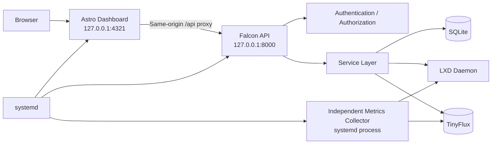

# Hobby Server Monitor

A lightweight on-premises LXD container management and monitoring platform built for a Software Engineer Intern technical assessment.

The application turns a Linux machine into a small internal testing server with:

- Google OAuth authentication
- Admin and container-user roles
- LXD container provisioning and lifecycle management
- Per-user resource quotas
- Container access assignments
- Historical CPU, memory, disk and network metrics
- Real container command execution through `pylxd`
- An independent background metrics collector
- SQLite application state
- TinyFlux time-series storage
- systemd deployment for API, collector and dashboard

The implementation intentionally prioritizes **security**, **resource efficiency**, and clear separation between the browser UI, API, background collector and LXD.

---

## Tech Stack

| Layer | Technology |
| --- | --- |
| Dashboard | Astro 7 |
| Backend API | Falcon 4 |
| Production WSGI server | Waitress |
| LXD integration | pylxd |
| Application database | SQLite |
| Metrics store | TinyFlux |
| Authentication | Google OAuth 2.0 / OpenID Connect |
| Service management | systemd |
| Python | Python 3.12 tested |
| Node.js | Node.js 22.12+ required |

Pinned Python dependencies are in `backend/requirements.txt`.

---

## Features

### Authentication and authorization

- Google OAuth 2.0 login
- Bootstrap administrator configured by email
- Invite-only access for additional Google accounts
- Two roles: `admin` and `container_user`
- Server-side authorization on protected API endpoints
- Direct access to an unassigned container returns `403`
- Random container IDs cannot be used by a container user to probe resources
- Revoking a user invalidates that user's sessions

### Session and CSRF security

- Opaque random session tokens
- Only hashes of session tokens are persisted
- `HttpOnly` session cookie
- `SameSite=Lax`
- Configurable `Secure` cookie flag
- Double-submit CSRF protection for mutations
- One-time OAuth state values
- OAuth PKCE support
- Expired sessions and OAuth states are cleaned up

### Container management

Administrators can:

- View all registered LXD containers
- Create containers
- Start, stop, restart, freeze and unfreeze containers
- Change RAM, CPU and disk limits
- Change limits while a container is running
- Delete containers with exact-name confirmation
- Assign an owner
- Configure autostart
- Configure ephemeral mode
- Select an available Ubuntu image
- Select an available LXD network
- Select an available storage pool
- Add an optional description

Container identity is stored using both the LXD UUID and current LXD name so application authorization is not based only on a mutable display name.

### Resource validation and quotas

Container creation and updates are validated server-side against:

- Host RAM capacity
- Host logical CPU capacity
- Storage-pool capacity
- Per-user RAM quota
- Per-user CPU quota
- Per-user disk quota
- Minimum RAM allocation
- Valid LXD storage pools
- Existing allocations from other managed containers

A quota value of `0` means unlimited at the user-quota level. Host limits are still enforced.

### User management

Administrators can:

- Invite a Google account by email
- Set a user's display name
- Select admin or container-user role
- Set RAM quota
- Set CPU quota
- Set disk quota
- Assign containers
- Unassign containers
- Revoke access

### Metrics

The independent collector samples container state approximately every 10 seconds.

Collected data includes:

- CPU percentage
- CPU usage time
- Memory used
- Memory limit
- Memory percentage
- Disk used
- Disk allocation when available
- Disk percentage when available
- Network RX bytes
- Network TX bytes
- RX bytes/second
- TX bytes/second
- Container state
- Uptime
- Process count

Historical data is available through the API and dashboard for selectable time ranges. The API limits the number of points returned to the browser.

### Terminal

Authenticated users can execute commands only inside containers to which they have access.

The implementation uses `pylxd` container execution rather than constructing a host shell command.

Additional controls include:

- Access check before execution
- Privileged-container execution blocked
- Command timeout
- Output-size limit
- Separate stdout and stderr
- Exit code returned to the UI

---

## Architecture



The collector does not run in the browser or API request path. Opening additional browser tabs therefore does not create additional polling loops against LXD.

---

## Repository Structure

```text
hobby-server-monitor/
├── .env.example
├── README.md
├── REPORT.md
├── backend/
│   ├── api/
│   ├── db/
│   ├── middleware/
│   ├── repositories/
│   ├── services/
│   ├── app.py
│   ├── collector.py
│   ├── config.py
│   ├── requirements.txt
│   └── run_backend_tests.py
├── dashboard/
│   ├── src/
│   ├── astro.config.mjs
│   └── package.json
└── deploy/
    ├── install-systemd.sh
    └── systemd/
        ├── hobby-server-monitor-api.service
        ├── hobby-server-monitor-collector.service
        └── hobby-server-monitor-dashboard.service
```

---

# Setup

## 1. System requirements

Recommended environment:

- Ubuntu 24.04 or compatible Linux
- WSL2 is suitable for development
- Python 3.10+; Python 3.12 was used during development
- Node.js 22.12+
- npm
- LXD 5.x
- systemd
- Google Cloud OAuth credentials

## 2. Clone the repository

```bash
git clone https://github.com/kjanuda/hobby-server-monitor.git
cd hobby-server-monitor
```

## 3. Install and initialize LXD

```bash
sudo snap install lxd
sudo usermod -aG lxd "$USER"
```

Log out and back in so the new group membership applies, then verify:

```bash
id -nG
```

Initialize LXD:

```bash
lxd init --minimal
```

Verify:

```bash
lxc list
lxc storage list
lxc network list
```

> Membership in the `lxd` group is highly privileged. See the Security section before using this on a production host.

## 4. Create the Python virtual environment

```bash
cd backend
python3 -m venv .venv
source .venv/bin/activate
python -m pip install --upgrade pip
pip install -r requirements.txt
cd ..
```

## 5. Install dashboard dependencies

```bash
cd dashboard
npm install
cd ..
```

Node.js must satisfy the version declared in `dashboard/package.json`.

## 6. Configure environment variables

```bash
cp .env.example .env
chmod 600 .env
nano .env
```

Example:

```dotenv
BOOTSTRAP_ADMIN_EMAIL=your-admin@gmail.com

GOOGLE_CLIENT_ID=your-google-client-id
GOOGLE_CLIENT_SECRET=your-google-client-secret
GOOGLE_REDIRECT_URI=http://localhost:4321/api/auth/google/callback

SESSION_COOKIE_NAME=hsm_session
SESSION_TTL_SECONDS=28800
SESSION_COOKIE_SECURE=false
CSRF_COOKIE_NAME=hsm_csrf

METRICS_INTERVAL_SECONDS=10
METRICS_RETENTION_HOURS=48
METRICS_DB_PATH=backend/data/metrics.csv
DISK_METRICS_INTERVAL_SECONDS=60

HSM_BACKEND_URL=http://127.0.0.1:8000
```

Never commit `.env`.

## 7. Configure Google OAuth

In Google Cloud Console:

1. Create or select a Google Cloud project.
2. Configure the OAuth consent screen.
3. Create an OAuth 2.0 Client ID for a web application.
4. Add this exact authorized redirect URI:

```text
http://localhost:4321/api/auth/google/callback
```

5. Copy the Client ID and Client Secret into `.env`.
6. Set `BOOTSTRAP_ADMIN_EMAIL` to the Google account that should become the initial administrator.

For HTTPS deployments, update both the Google OAuth redirect URI and `.env`, and set:

```dotenv
SESSION_COOKIE_SECURE=true
```

## 8. Initialize the SQLite database

```bash
cd backend
source .venv/bin/activate
python -m db.init_db
cd ..
```

The initialization process creates the schema if needed and seeds the configured bootstrap administrator. It refuses to silently promote an existing non-admin account with the same bootstrap email.

---

# Running in Development

Use separate terminals.

### API

```bash
cd backend
source .venv/bin/activate
python app.py
```

API: `http://127.0.0.1:8000`

### Metrics collector

```bash
cd backend
source .venv/bin/activate
python collector.py
```

### Astro dashboard

```bash
cd dashboard
npm run dev
```

Dashboard: `http://localhost:4321`

The Astro server proxies `/api/*` to the Falcon backend.

---

# Production-style systemd Deployment

The repository includes systemd templates for:

- `hobby-server-monitor-api.service`
- `hobby-server-monitor-collector.service`
- `hobby-server-monitor-dashboard.service`

The installer validates the service user, checks LXD group membership, verifies the Python environment and `.env`, locates Node.js/npm, checks the Node version, builds Astro, renders the service templates, installs them, and enables them for boot.

Run:

```bash
./deploy/install-systemd.sh
```

Then:

```bash
sudo systemctl restart hobby-server-monitor-api.service
sudo systemctl restart hobby-server-monitor-collector.service
sudo systemctl restart hobby-server-monitor-dashboard.service
```

Check:

```bash
systemctl is-active \
  hobby-server-monitor-api.service \
  hobby-server-monitor-collector.service \
  hobby-server-monitor-dashboard.service
```

Verify units:

```bash
sudo systemd-analyze verify \
  /etc/systemd/system/hobby-server-monitor-api.service \
  /etc/systemd/system/hobby-server-monitor-collector.service \
  /etc/systemd/system/hobby-server-monitor-dashboard.service
```

Test dashboard:

```bash
curl -sS -o /dev/null \
  -w 'HTTP %{http_code}\n' \
  http://127.0.0.1:4321/
```

---

# Bootstrap Administrator

This project uses an explicit bootstrap-admin email rather than a "first person to sign in wins" policy.

Set:

```dotenv
BOOTSTRAP_ADMIN_EMAIL=your-admin@gmail.com
```

Then initialize the database. The matching email is inserted as an invited administrator. On Google login, the account identity must match an invited active user.

---

# Roles

| Capability | Admin | Container User |
| --- | ---: | ---: |
| View all containers | Yes | No |
| View assigned containers | Yes | Yes |
| View container metrics | Yes | Assigned only |
| Use container terminal | Yes | Assigned only |
| Create containers | Yes | No |
| Change container limits | Yes | No |
| Lifecycle actions | Yes | No |
| Delete containers | Yes | No |
| Manage users | Yes | No |
| Manage assignments | Yes | No |
| View own quota | Yes | Yes |

Authorization is enforced by the backend. UI hiding is not considered a security boundary.

---

# API Reference

## Health

| Method | Endpoint | Access | Description |
| --- | --- | --- | --- |
| GET | `/api/health` | Public | API health check |

## Authentication

| Method | Endpoint | Access | Description |
| --- | --- | --- | --- |
| GET | `/api/auth/google/login` | Public | Start Google OAuth |
| GET | `/api/auth/google/callback` | Public | OAuth callback |
| GET | `/api/auth/me` | Authenticated | Current user and CSRF information |
| POST | `/api/auth/logout` | Authenticated | Invalidate session |

## Containers

| Method | Endpoint | Access | Description |
| --- | --- | --- | --- |
| GET | `/api/containers` | Authenticated | Admin: all containers; user: assigned containers |
| POST | `/api/containers` | Admin | Create container |
| GET | `/api/containers/{id}` | Authorized user | Container details |
| PATCH | `/api/containers/{id}` | Admin | Change resource limits |
| DELETE | `/api/containers/{id}` | Admin | Delete with confirmation |
| GET | `/api/containers/{id}/metrics` | Authorized user | Historical metrics |
| POST | `/api/containers/{id}/actions/{action}` | Admin | Lifecycle action |
| POST | `/api/containers/{id}/terminal` | Authorized user | Execute command |

Supported lifecycle actions: `start`, `stop`, `restart`, `freeze`, `unfreeze`.

### Create container request

```json
{
  "name": "dev-server",
  "image": "ubuntu:24.04",
  "memory": "512MiB",
  "cpu_cores": 1,
  "cpu_allowance": 100,
  "disk": "5GiB",
  "storage_pool": "default",
  "network": "lxdbr0",
  "owner_user_id": 3,
  "ephemeral": false,
  "autostart": true,
  "description": "Development environment"
}
```

### Update limits request

```json
{
  "memory": "768MiB",
  "cpu_cores": 1,
  "cpu_allowance": 80,
  "disk": "5GiB"
}
```

Disk shrinking is intentionally rejected.

### Delete request

```json
{
  "confirm_name": "dev-server"
}
```

### Terminal request

```json
{
  "command": "hostname"
}
```

## Discovery and host resources

| Method | Endpoint | Access | Description |
| --- | --- | --- | --- |
| GET | `/api/container-options` | Admin | Runtime images, networks and storage pools |
| GET | `/api/host/resources` | Admin | Host capacity and current allocations |
| GET | `/api/storage-pools` | Admin | Storage-pool information |
| GET | `/api/me/quota` | Authenticated | User quota, usage and remaining allocation |

## Users

| Method | Endpoint | Access | Description |
| --- | --- | --- | --- |
| GET | `/api/users` | Admin | List users |
| POST | `/api/users` | Admin | Invite user |
| PATCH | `/api/users/{id}` | Admin | Update role/name/quotas |
| DELETE | `/api/users/{id}` | Admin | Revoke user |

## Assignments

| Method | Endpoint | Access | Description |
| --- | --- | --- | --- |
| GET | `/api/users/{user_id}/containers` | Admin | List assignments |
| PUT | `/api/users/{user_id}/containers/{container_id}` | Admin | Assign container |
| DELETE | `/api/users/{user_id}/containers/{container_id}` | Admin | Remove assignment |

---

# Data Model

SQLite stores authorization and management state.

## `users`

Important fields:

`id`, `email`, `name`, `google_sub`, `role`, `invited`, `active`,
`ram_quota_bytes`, `cpu_quota`, `disk_quota_bytes`, `created_at`, `updated_at`.

## `sessions`

Stores a hash of the session token rather than the raw token.

## `containers`

Stores `lxd_uuid` and `lxd_name` separately so authorization and metric history can rely on stable identity.

## `container_access`

Many-to-many user/container assignment table with cascading foreign keys.

## `audit_logs`

Tracks security-sensitive and destructive actions.

## `oauth_states`

Stores single-use OAuth state hashes, PKCE verifier data and expiry.

---

# TinyFlux Metrics Layout

Measurement:

```text
container_metrics
```

Tags include:

```text
container_uuid
container_name
state
```

Fields include:

```text
cpu_percent
cpu_usage_ns
memory_used_bytes
memory_limit_bytes
memory_percent
processes
rx_bytes
tx_bytes
rx_bytes_per_second
tx_bytes_per_second
uptime_seconds
disk_used_bytes
disk_allocated_bytes
disk_percent
```

Raw metrics are retained according to:

```dotenv
METRICS_RETENTION_HOURS=48
```

---

# Metrics Collector Design

The collector is a separate Python process (`backend/collector.py`) and runs independently from browser sessions, Astro requests and Falcon API requests.

Default polling:

```dotenv
METRICS_INTERVAL_SECONDS=10
```

Disk usage is sampled less frequently:

```dotenv
DISK_METRICS_INTERVAL_SECONDS=60
```

When LXD is unavailable, the collector logs the failure, inserts no invalid sample, and continues running. When LXD becomes available again, collection resumes automatically without restarting the collector.

---

# Security Notes

## LXD privilege boundary

A process with access to the local LXD daemon has extremely powerful host capabilities. Membership in the `lxd` group should therefore be treated as effectively root-equivalent for threat-model purposes.

The current design reduces exposure by:

- not giving the Astro dashboard LXD group membership
- keeping the Falcon backend bound to loopback
- enforcing authorization before container access
- validating container inputs server-side
- executing terminal commands inside the LXD container rather than through a host shell
- blocking terminal access to privileged containers
- using systemd hardening options

Systemd hardening includes:

```text
NoNewPrivileges=true
PrivateTmp=true
ProtectSystem=full
RestrictSUIDSGID=true
UMask=0077
```

For a higher-security production design, LXD access should be isolated behind a narrowly scoped local broker instead of exposing the daemon directly to the main API process.

## OAuth and sessions

Only invited accounts can authenticate successfully. The application uses one-time OAuth state, PKCE, stable Google subject identity, session expiry and revoked-user checks.

## CSRF

State-changing authenticated requests require a CSRF token matching the CSRF cookie.

## Secrets

Real credentials belong only in `.env`. Never commit Google client secrets, session tokens or other credentials.

If a credential is accidentally exposed, revoke or rotate it rather than relying only on removing it from Git history.

---

# Resource Efficiency

The design uses:

- Falcon rather than a heavier backend framework
- SQLite for local relational state
- TinyFlux for local time-series data
- one collector regardless of browser count
- 10-second polling
- cached/slower disk measurements
- server-side historical point reduction
- the Astro production server rather than its development server

Measured production resource usage is documented in `REPORT.md`.

---

# Testing

Run:

```bash
cd backend
source .venv/bin/activate
python run_backend_tests.py
```

The final regression run completed:

```text
Passed: 26/26
Result: BACKEND REGRESSION PASS
```

Frontend checks:

```bash
cd dashboard
npm run astro -- check
npm run build
```

---

# Failure and Recovery Testing

The collector was tested with the API and dashboard stopped. It continued inserting metrics approximately every 10 seconds.

The collector was also tested with both the LXD daemon and its activating Unix socket stopped. `lxc list` failed with connection refused while the collector remained active with `NRestarts=0`.

After LXD was restored, valid metric inserts resumed automatically without restarting the collector.

---

# Operational Notes

Default production-style bindings:

```text
Dashboard: 127.0.0.1:4321
API:       127.0.0.1:8000
```

For LAN or Internet access, place the dashboard behind an HTTPS reverse proxy and keep the Falcon API private.

For HTTPS:

```dotenv
SESSION_COOKIE_SECURE=true
```

and configure the matching HTTPS callback URL in Google Cloud.

---

# Known Limitations

- Deployment was tested on Ubuntu 24.04 under WSL2.
- The dashboard is bound to localhost by default.
- LXD daemon access remains a powerful privilege.
- Raw metric retention is 48 hours rather than a multi-tier month-scale aggregation system.
- Containers created outside this application without explicit limits cannot always be allocation-accounted as accurately as application-managed containers.
- Disk measurement is more expensive than other metrics and is sampled less frequently.
- Alerting, snapshots, email notifications and multi-host management are not implemented.
- A real second Google account should be used for a complete browser-level container-user OAuth demonstration; backend authorization is covered by automated tests.

---

# Troubleshooting

## LXD permission denied

```bash
id -nG
```

The service user must belong to the `lxd` group.

## Dashboard returns API errors

```bash
systemctl status hobby-server-monitor-api.service
curl http://127.0.0.1:8000/api/health
```

## Google OAuth redirect mismatch

For the local setup the Google Cloud redirect URI must exactly match:

```text
http://localhost:4321/api/auth/google/callback
```

## Collector cannot reach LXD

```bash
systemctl status snap.lxd.daemon.service
lxc list
```

The collector is designed to remain alive during a temporary LXD outage and recover automatically.

---

# Final Report

Implementation decisions, issues encountered, resource measurements, AI-tool usage and known limitations are documented in `REPORT.md`.

---

## License

See `LICENSE`.
